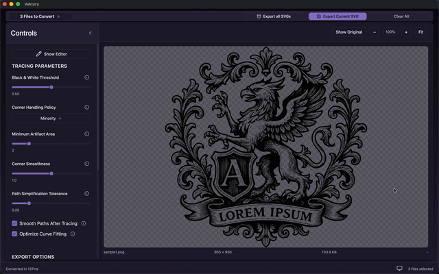
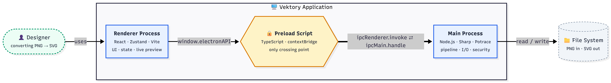
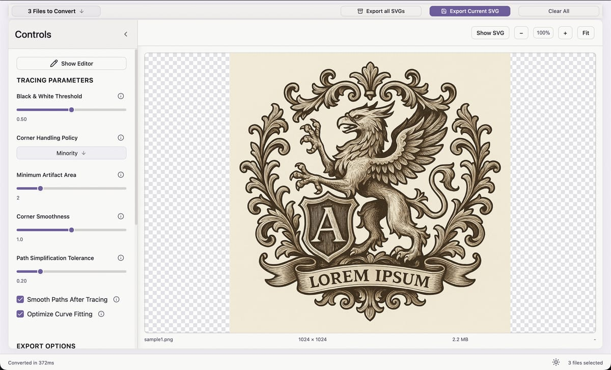
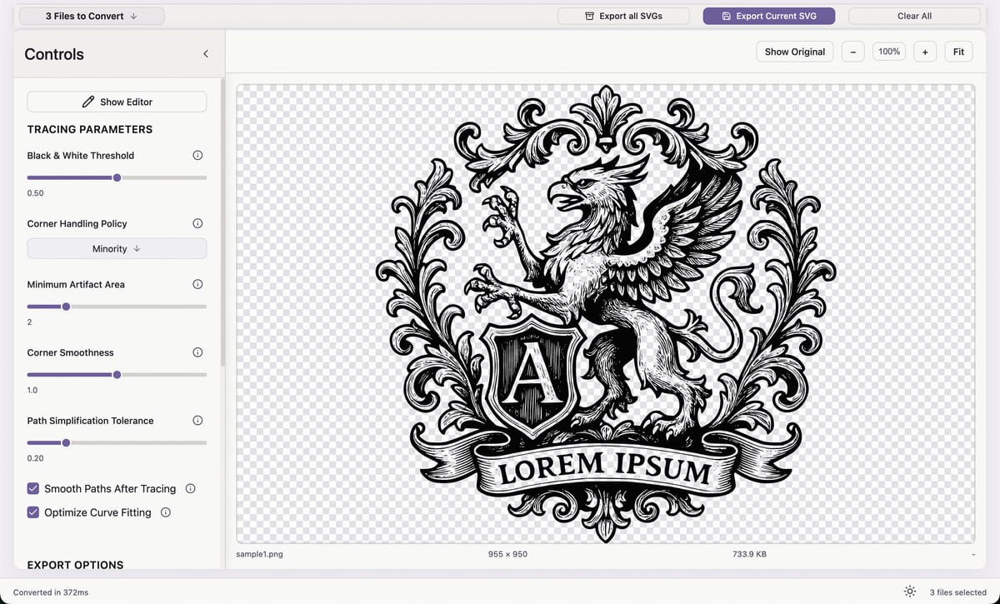

# Vektory

A desktop application for converting PNG images to SVG using the Potrace vectorization algorithm. Built with Electron, TypeScript, React, and Vite.

---

## Architecture

Key architectural decisions:
- Renderer is sandboxed — no Node, no fs, no raw IPC (`nodeIntegration: false`, `contextIsolation: true`) — [ADR 0002](docs/adr/0002-context-isolation-and-preload-api.md)
- Dual build: `tsc` for main process, Vite for renderer — [ADR 0003](docs/adr/0003-react-and-vite-for-renderer.md)
- Per-file SVG cache keyed on options — avoids re-tracing on file switch — [ADR 0007](docs/adr/0007-options-based-svg-cache.md)
- Tight viewBox via cubic Bezier extrema — editor-compatible output (Figma, Illustrator, Sketch) — [ADR 0010](docs/adr/0010-tight-viewbox-cubic-bezier.md)

[Full architecture with sequence diagrams →](https://ViktoriaFox.github.io/Vektory/architecture)

---

## Screenshots

**Before / After**

| Original PNG | Converted SVG |
|--------------|---------------|
|  |  |

---

## Download and install

| Platform | File |
|----------|------|
| Windows 10/11 (64-bit) | [Vektory-1.0.0.exe](../../releases/latest/download/Vektory-1.0.0.exe) |
| macOS 12+ (Intel + Apple Silicon) | [Vektory-1.0.0.dmg](../../releases/latest/download/Vektory-1.0.0.dmg) |

Both binaries are unsigned — see the [Install Guide](https://ViktoriaFox.github.io/Vektory/install) for SmartScreen and Gatekeeper workarounds.

---

## Technical stack

| Layer | Technology |
|-------|-----------|
| Desktop shell | Electron 38 |
| Language | TypeScript 5 |
| Renderer UI | React 19 |
| Bundler (renderer) | Vite 7 |
| State management | Zustand 5 |
| UI primitives | Radix UI |
| Image processing | Sharp 0.32 |
| Vectorization | Potrace 2.1 |

---

## Architectural decision records

Selected architectural decisions — the non-obvious ones:

| ADR | Decision |
|-----|----------|
| [0002](docs/adr/0002-context-isolation-and-preload-api.md) | Context isolation and preload-only IPC API |
| [0007](docs/adr/0007-options-based-svg-cache.md) | Options-based SVG cache invalidation |
| [0008](docs/adr/0008-dual-independent-view-state.md) | Dual independent view state (SVG vs Original) |
| [0010](docs/adr/0010-tight-viewbox-cubic-bezier.md) | Tight SVG viewBox via cubic Bezier extrema |

[All ten ADRs on the docs site →](https://ViktoriaFox.github.io/Vektory/adr/)

---

## Documentation

- [Architecture](https://ViktoriaFox.github.io/Vektory/architecture) — container diagram, sequence diagrams, design decisions
- [ADRs](https://ViktoriaFox.github.io/Vektory/adr/) — ten architectural decision records
- [Install Guide](https://ViktoriaFox.github.io/Vektory/install) — download and installation steps
- [Settings Guide](https://ViktoriaFox.github.io/Vektory/settings-guide) — full parameter reference
- [Changelog](https://ViktoriaFox.github.io/Vektory/CHANGELOG) — v1.0 release notes

---

## License

Documentation: [CC BY 4.0](https://creativecommons.org/licenses/by/4.0/) — Viktoria Neva, 2026  
Application binaries: Proprietary — all rights reserved
