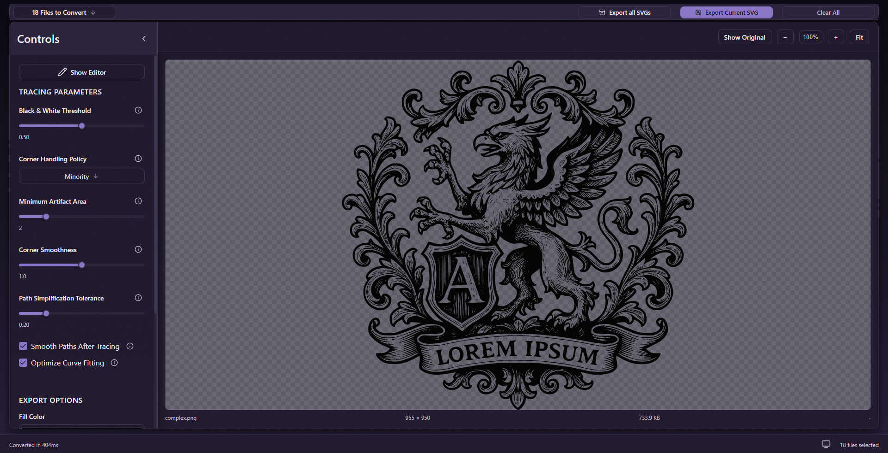
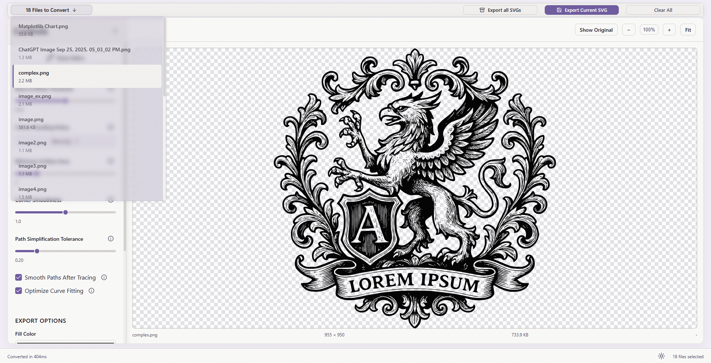

A desktop application for converting PNG images to SVG using the Potrace vectorization algorithm. Built with Electron, TypeScript, React, and Vite.

This is a **v1 portfolio project** — the goal is to demonstrate architectural thinking: how the Electron process boundary is designed, how state is structured, how the conversion pipeline is organized. The source code is private; this site documents the decisions.

[Download for Windows or macOS](https://github.com/ViktoriaFox/Vektory-Application/releases/latest){: .btn} [Architecture](architecture){: .btn} [ADRs](adr/){: .btn}

---

## Screenshots

| Dark mode | Light mode |
|-----------|------------|
|  |  |

---

## Key design decisions

- **Sandboxed renderer** — `nodeIntegration: false`, `contextIsolation: true`. The UI process cannot touch the file system or IPC directly. All communication goes through a typed `contextBridge` API (`window.electronAPI`). ([ADR 0002](adr/0002-context-isolation-and-preload-api))
- **Dual build pipeline** — main process compiled with `tsc`, renderer bundled with Vite. Independent pipelines, independent HMR in dev. ([ADR 0003](adr/0003-react-and-vite-for-renderer))
- **Tight SVG bounding box** — `pathBounds()` solves cubic bezier extrema analytically for pixel-accurate `viewBox` values, rather than using the control-point convex hull which over-estimates bounds.

---

## Download

| Platform | File |
|----------|------|
| Windows 10/11 (64-bit) | [Vektory-1.0.0.exe](../../releases/latest/download/Vektory-1.0.0.exe) |
| macOS 12+ (Intel + Apple Silicon) | [Vektory-1.0.0.dmg](../../releases/latest/download/Vektory-1.0.0.dmg) |

See the [Install Guide](install) for SmartScreen and Gatekeeper workarounds (the binaries are unsigned).
